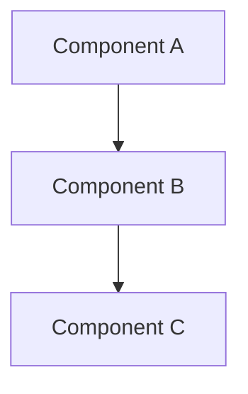

# Project Development Documentation Cycle Instructions

## Overview
This document defines the documentation standards and practices for maintaining up-to-date technical documentation at multiple levels throughout the development cycle of the calendars-cc project.

## Documentation Hierarchy

### 1. Solution Level Documentation (Root Level)
**Location**: Root directory of the project
**Files**: `README.md`, `ARCHITECTURE.md`, `DEPLOYMENT.md`

#### README.md Requirements
- Project overview and purpose
- Technology stack and key dependencies
- Quick start guide
- Development setup instructions
- Available scripts and commands
- Contributing guidelines

#### ARCHITECTURE.md Requirements
- High-level system architecture diagram (Mermaid)
- Technology stack breakdown
- Core dependencies and their purpose
- Project structure overview
- Data flow diagrams
- Security considerations
- Always refer to API_SERVICES.md for API service structure and conventions

#### DEPLOYMENT.md Requirements
- Deployment architecture diagram (Mermaid)
- Environment configurations
- Infrastructure requirements
- CI/CD pipeline documentation
- Monitoring and logging setup

### 2. Module Level Documentation
**Location**: Within each module/service directory
**Files**: `{module-name}.md` (e.g., `calendar-api.md`, `auth-service.md`)

#### Module Documentation Structure
Each module must have its own `.md` file containing:

1. **Purpose & Scope**
   - What the module does
   - Business requirements it addresses
   - Key functionalities

2. **Technical Design**
   - Module architecture diagram (Mermaid)
   - Component relationships
   - Data models and interfaces
   - API endpoints (if applicable)

3. **Framework & Tools**
   - Technologies used
   - External dependencies
   - Configuration requirements

4. **Implementation Details**
   - Key algorithms or business logic
   - Error handling strategies
   - Performance considerations

5. **Testing Strategy**
   - Unit test approach
   - Integration test scenarios
   - Mock data and test utilities

6. **Integration Points**
   - Dependencies on other modules
   - External service integrations
   - Data exchange patterns

## Documentation Standards

### Mermaid Diagrams
Use Mermaid syntax for all diagrams:
- **Architecture diagrams**: Use `graph TD` or `graph LR`
- **Sequence diagrams**: Use `sequenceDiagram`
- **Class diagrams**: Use `classDiagram`
- **Flow charts**: Use `flowchart TD`

### File Naming Convention
- Solution level: `README.md`, `ARCHITECTURE.md`, `DEPLOYMENT.md`
- Module level: `{module-folder-name}.md`
- Place module docs in the respective module directory

### Content Guidelines
- Use clear, concise language
- Include code examples where helpful
- Keep diagrams simple and focused
- Update version history for significant changes
- Use consistent formatting and structure

## Development Workflow Integration

### Before Every Development Task
**MANDATORY**: Always include relevant documentation as context:

1. **Identify Affected Modules**
   - Determine which modules will be modified
   - Locate corresponding documentation files

2. **Include Documentation in Context**
   - Read and include solution-level docs for architecture understanding
   - Include specific module documentation for affected components
   - Reference any related API documentation

3. **Verify Current State**
   - Check if existing documentation accurately reflects current implementation
   - Note any discrepancies that need updates

### During Development
1. **Document Design Decisions**
   - Record architectural choices and rationale
   - Update module documentation with new components
   - Modify diagrams to reflect changes

2. **Update Integration Points**
   - Document new dependencies or integrations
   - Update API contracts and interfaces
   - Reflect changes in data flow diagrams

### After Development (Definition of Done)
1. **Update Documentation**
   - Ensure all affected module docs are current
   - Update solution-level architecture if needed
   - Refresh deployment docs for infrastructure changes

2. **Validate Documentation**
   - Verify code examples still work
   - Check that diagrams accurately represent the system
   - Ensure new features are properly documented

3. **Review and Approve**
   - Include documentation updates in code reviews
   - Validate that docs match implementation
   - Ensure consistency across all documentation levels

## Module Documentation Mapping

Based on current project structure, create documentation for:

### Core Modules
- `src/app/api-services/api-services.md` - API service layer documentation
- `src/app/components/components.md` - UI components documentation
- `src/app/services/services.md` - Business logic services documentation
- `src/app/guards/guards.md` - Security and routing guards documentation

### Specific Service Modules
- `src/app/api-services/calendar/calendar-api.md`
- `src/app/api-services/rules/rules-api.md`
- `src/app/api-services/settings/settings-api.md`
- `src/app/api-services/stats/stats-api.md`

### Component Modules
- `src/app/components/auth/auth-components.md`
- `src/app/components/dashboard/dashboard.md`
- `src/app/components/calendar/calendar.md`
- `src/app/components/rules/rules.md`

## Quality Checklist

Before considering documentation complete:
- [ ] All affected modules have updated documentation
- [ ] Solution-level architecture reflects current state
- [ ] Mermaid diagrams are syntactically correct and render properly
- [ ] Code examples are tested and working
- [ ] Integration points are clearly documented
- [ ] Performance and security considerations are addressed
- [ ] Documentation follows established formatting standards
- [ ] Version history is updated for significant changes

## Templates

### Module Documentation Template
```markdown
# {Module Name}

## Purpose & Scope
Brief description of what this module does and why it exists.

## Technical Design


## Framework & Tools
- Framework: Angular 17
- Dependencies: [list key dependencies]
- Configuration: [describe configuration needs]

## Implementation Details
Key implementation notes, algorithms, and business logic.

## Testing Strategy
Describe testing approach and key test scenarios.

## Integration Points
- Dependencies: [list module dependencies]
- External services: [list external integrations]
- Data exchange: [describe data flow]
```

## Maintenance Schedule
- **Weekly**: Review and update module docs for recent changes
- **Sprint End**: Comprehensive documentation review
- **Release**: Full documentation validation and updates
- **Quarterly**: Architecture documentation review and updates
